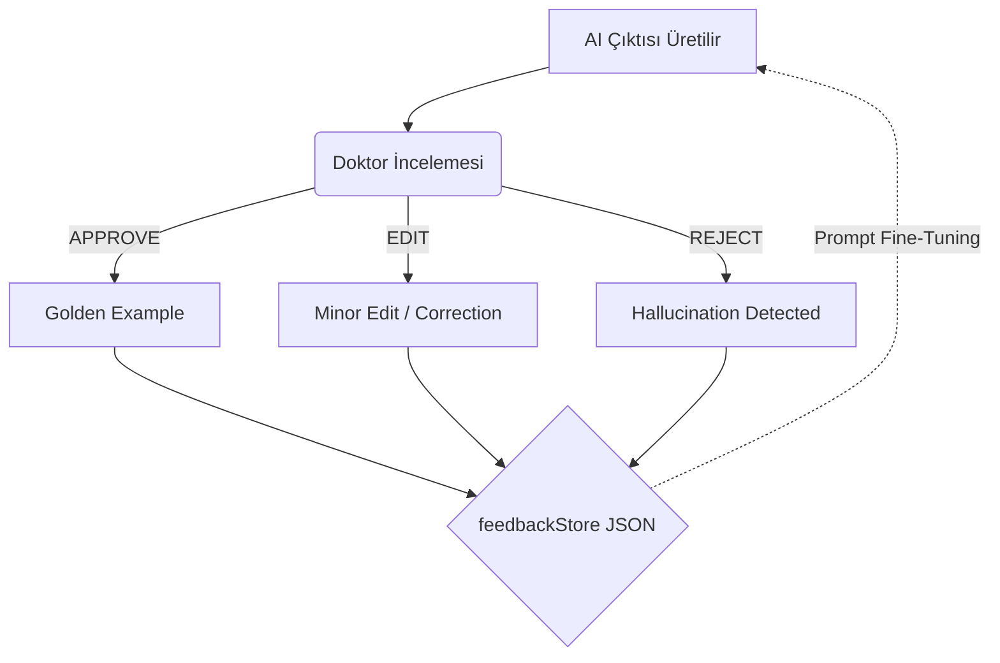

# DxTrace

> **Kanıta Kilitli, Çelişki Denetimli ve Doktor Onaylı Klinik LLM Platformu**

DxTrace, hekimlerin klinik karar alma süreçlerini güçlendiren ve tüm "AI" çıktılarının kaynağını şeffaf bir şekilde sunan profesyonel bir *ikinci klinik beyin* platformudur. Temel prensibimiz: **"Kanıt yoksa, iddia da yok."**

Bu depo, DxTrace'in tam yığın (full-stack) mimarisini, veri akışını ve arayüz bileşenlerini içermektedir.

---

## 🎨 Tasarım Sistemi ve Renk Paleti

DxTrace, klinik profesyonellere yönelik modern, yorucu olmayan ve "premium" bir hissiyat veren özel bir karanlık mod (dark mode) tasarım sistemine sahiptir.

**Ana Arka Plan ve Yüzeyler**
- `Deep Background`: `#060b14` (Ana uygulama arka planı)
- `Base Background`: `#0a101e` (Genel zemin)
- `Surface 1-3`: `#0f1829` → `#141f35` → `#1a2640` (Kartlar ve paneller için katmanlama)

**Semantik Renkler (Durum Bildirimleri)**
- 🔴 **Kritik (Critical)**: `#ef4444` — Acil sinyaller, halüsinasyon tespitleri ve reddedilen LLM çıktıları.
- 🟠 **Uyarı (Warning)**: `#f59e0b` — Eksik veriler, açık takip döngüleri ve doktor düzenlemeleri.
- 🟢 **Başarılı (Success)**: `#10b981` — Doğrulanmış LLM özetleri, onaylanmış aksiyonlar ve tamamlanmış döngüler.
- 🔵 **Bilgi (Info)**: `#3b82f6` — Standart bildirimler ve aktif modül vurguları.
- 🟣 **Yapay Zeka (AI/LLM)**: `#8b5cf6` — LLM ve Verifier Agent tarafından üretilen içerik ve aksiyon butonları.

*Tasarım token'ları `client/src/styles/tokens.css` içinde global olarak tanımlanmış ve CSS değişkenleri (CSS variables) ile bileşenlere dağıtılmıştır.*

---

## 🧩 Komponent Mimarisi (Frontend)

Uygulamanın React tabanlı web arayüzü, modüler, yeniden kullanılabilir ve "Micro-interactions" odaklı olarak tasarlanmıştır. 

```text
client/src/components/
├── Layout/
│   ├── Header.jsx           # Üst gezinme çubuğu ve API durum göstergesi
│   └── Sidebar.jsx          # Analiz tetikleyicisi, modül durumları, LLM etkileşimi ve Feedback Geçmişi
├── Dashboard/
│   ├── ClinicalSummary.jsx  # LLM tabanlı, kaynaklı klinik özet paneli
│   ├── CasSignalCard.jsx    # CAS_GI_01 vb. risk sinyallerini gösteren uyarı kartı
│   ├── TabbedPanel.jsx      # Ana veri sekmelerini barındıran kapsayıcı
│   ├── EvidencePanel.jsx    # 0-100 puanlı kanıtların listelendiği panel
│   ├── ConflictPanel.jsx    # Çelişkili verileri eşleştiren görünüm
│   ├── FollowupPanel.jsx    # "Açık/Kapalı Döngü" takip elemanları
│   ├── MissingDataPanel.jsx # Eksik/eski tetkik uyarıları
│   ├── TimelinePanel.jsx    # Kronolojik hasta olayları şeridi
│   └── SkeletonLoader.jsx   # (Micro-interaction) Yükleme anında ekran titremesini önleyen shimmer iskelet
├── Badge/
│   └── Badge.jsx            # Dinamik renkli durum (Success/Warning/Critical vb.) rozetleri
└── Toast/
    └── ToastProvider.jsx    # Sistem geneli bildirim (toast) altyapısı
```

### Mikro-Etkileşimler (Micro-interactions)

> [!TIP]
> **Kusursuz Kullanıcı Deneyimi (UX)**
> 1. **Skeleton Loaders:** Vaka değişimlerinde (Örn: Vaka 002'ye geçiş) veya analiz API'den gelene kadar ekran donmaz veya boşalmaz. Yükleme süresi boyunca orijinal düzeni taklit eden animasyonlu "Skeleton Loader" iskelet kutular gösterilerek profesyonel hissiyat zirveye taşınır.
> 2. **Hover Geçişleri:** Menü ve liste elemanlarının üzerine gelindiğinde (hover) ince renk değişimleri, belirginleşme efektleri ve `box-shadow` aydınlanmaları ile dinamik bir etkileşim sunulur.

---

## 🔄 Veri Akış Şeması ve Feedback Loop

Sistemin kalbi, backend üzerinde çalışan çeşitli modüllerin eşzamanlı çalışması ve kullanıcı eylemlerinin sisteme geri beslenmesine dayanır.

### 1. Vaka Analiz Akışı (`POST /cases/analyze`)
1. **İstem (Client):** `Sidebar.jsx` üzerinden "Analiz Et" butonuna basılır. Seçili vaka ID'si API'ye gönderilir.
2. **Klinik Motorlar (Backend):**
   - `evidenceStore`: Kayıtları okuyup standart "Kanıt" nesnelerine çevirir.
   - `confidenceScorer`: Kanıtlara kaynağına ve yaşına göre 0-100 puan atar.
   - `contradictionEngine`: Çelişkili bulguları tarar (Örn: "Sigara içmiyor" vs "Günde 1 paket").
   - `missingDataDetector`: Klinik tabloya göre eksik veya 6 aydan eski kritik testleri listeler.
   - `followupTracker`: Doktor notlarındaki planlanan işlemleri arar ve durumunu (Açık/Kapalı) hesaplar.
   - `riskSignalEngine`: Erken risk sinyallerini hesaplar (Örn: *CAS_GI_01*).
3. **Verifier Agent (LLM Güvenliği):** LLM çıktısını üretmeden/iletmeden önce "Halüsinasyon" denetimi yapar. Kaynaksız bilgiler veya yasaklı tanılar metinden elenir.
4. **Yanıt (Response):** Tamamen işlenmiş JSON nesnesi frontend'e döner ve React `useDxTrace` kancası üzerinden state güncellenir.

### 2. Yapay Zeka Geri Besleme Döngüsü (Feedback Loop)

> [!IMPORTANT]
> **Kendi Hatasından Öğrenen Sistem:** Klinik araçlar için en kritik yerlerden biri "Doktor Geri Bildirimi"dir. Doktor bir AI çıktısını reddederse (REJECT) veya manuel bir düzeltme yaparsa (EDIT), bu aksiyon arka planda sadece kaydedilmekle kalmaz. `feedbackStore.js` üzerinden özel bir veritabanı tablosuna (JSON loglarına) loglanır. Bu sayede sistemin halüsinasyonları yakalaması ve LLM promptlarının sürekli iyileştirilmesi sağlanır.




**Feedback Mimarisinin Temel Özellikleri:**
- **In-Memory Audit Log:** `auditLog.js`, güvenlik ve izlenebilirlik için eylemleri anlık hafızada tutar (oturum ömrünce).
- **Kalıcı JSON Store:** `feedbackStore.js`, onay (APPROVE), düzeltme (EDIT) ve ret (REJECT) aksiyonlarını `llm_feedback_log.json` adlı dosyaya yazar. Üretim ortamında bu modül SQL/NoSQL veritabanına bağlanır.
- **Analitik Endpointler:**
  - `GET /feedback/store/stats`: Toplam başarı/hata oranlarını ve halüsinasyon yüzdesini verir.
  - `GET /feedback/store/hallucinations`: Sadece doktor tarafından reddedilmiş örnekleri döndürür. Bu veriler gelecekteki LLM "Negative Prompt" yapılandırmasında kullanılır.

---

## 🚀 Projeyi Çalıştırma

### Gereksinimler
- Node.js (v18 veya üzeri önerilir)
- NPM veya Yarn

### Ortamı Hazırlama ve Başlatma

1. **Bağımlılıkları Yükleme:**
   ```bash
   # Kök dizin bağımlılıkları (Backend)
   npm install

   # İstemci dizini bağımlılıkları (Frontend)
   cd client
   npm install
   cd ..
   ```

2. **Geliştirme Sunucularını Başlatma:**
   Kök dizinden tek bir komutla hem backend (API) hem de frontend (Vite) sunucularını başlatabilirsiniz:
   ```bash
   npm run dev:web
   ```

   - **Backend API:** `http://localhost:3000`
   - **Web Arayüzü:** `http://localhost:5173`

---

## 📱 Mobil Uygulama (Expo React Native)

Projenin aynı tasarım dili ve API mimarisini kullanan bir React Native (Expo) mobil versiyonu `mobile/` dizini altında yer almaktadır.

**Çalıştırmak için:**
```bash
cd mobile
npm install
npx expo start --clear
```

*Not: `mobile/src/api/dxtrace.js` içindeki `BASE_URL` adresini bilgisayarınızın yerel LAN IP adresiyle değiştirmeniz gerekir (Örn: `http://192.168.x.x:3000`).*

---

> *"The art of medicine consists of amusing the patient while nature cures the disease."*
> — Voltaire *(Biz yine de kanıtlarımızı sağlam tutalım!)*
